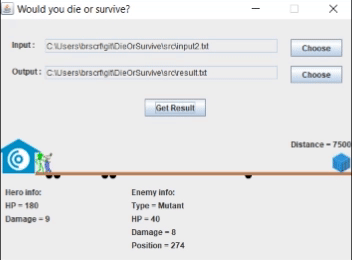
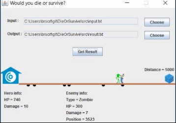

# Die Or Survive
This project intends to represent objective programming

## Visual interface
Shows user each action and info at the moment as an animation. Gives options to choose your .txt files
                          

This is [the runnable jar file](dieorsurvive.jar) of the project.
